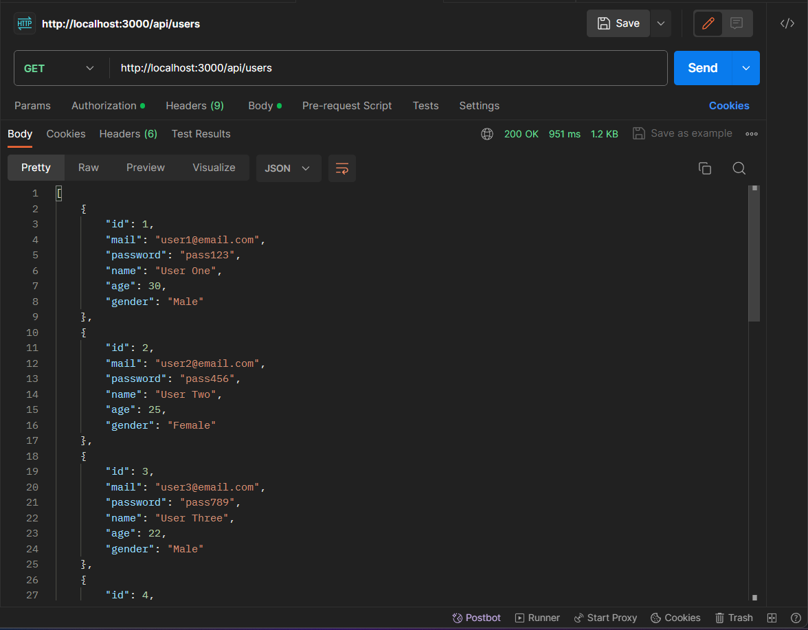
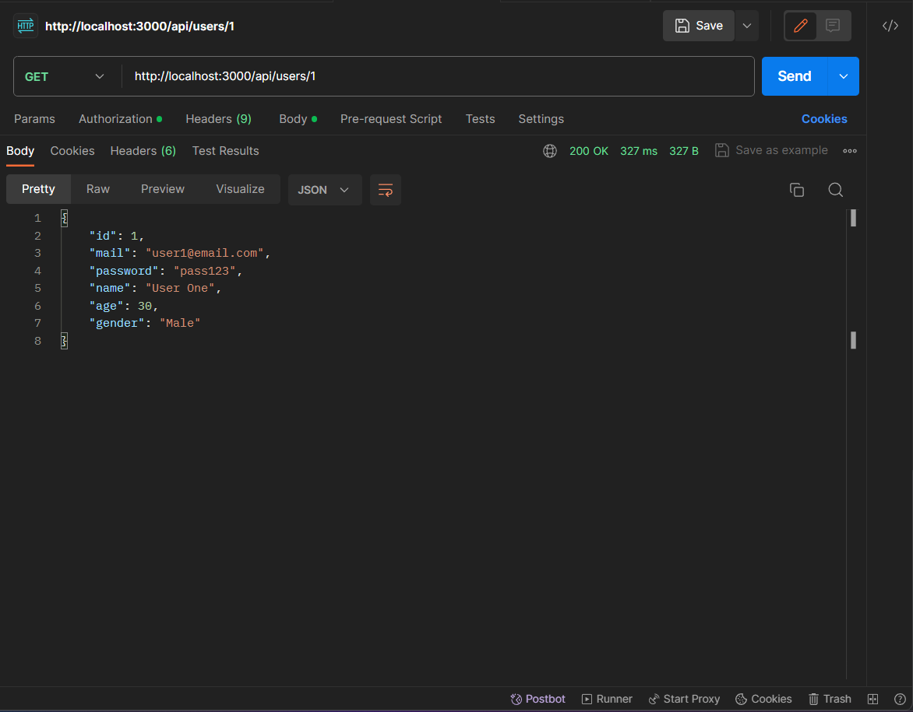
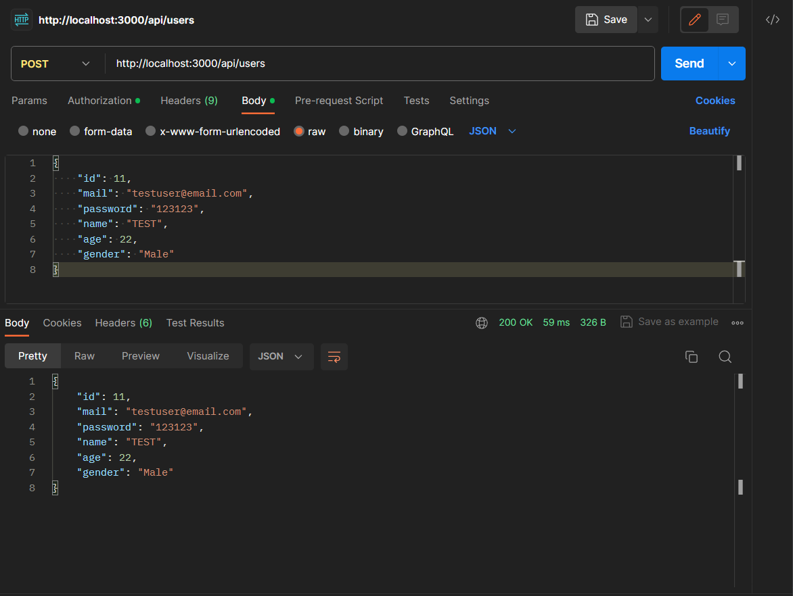
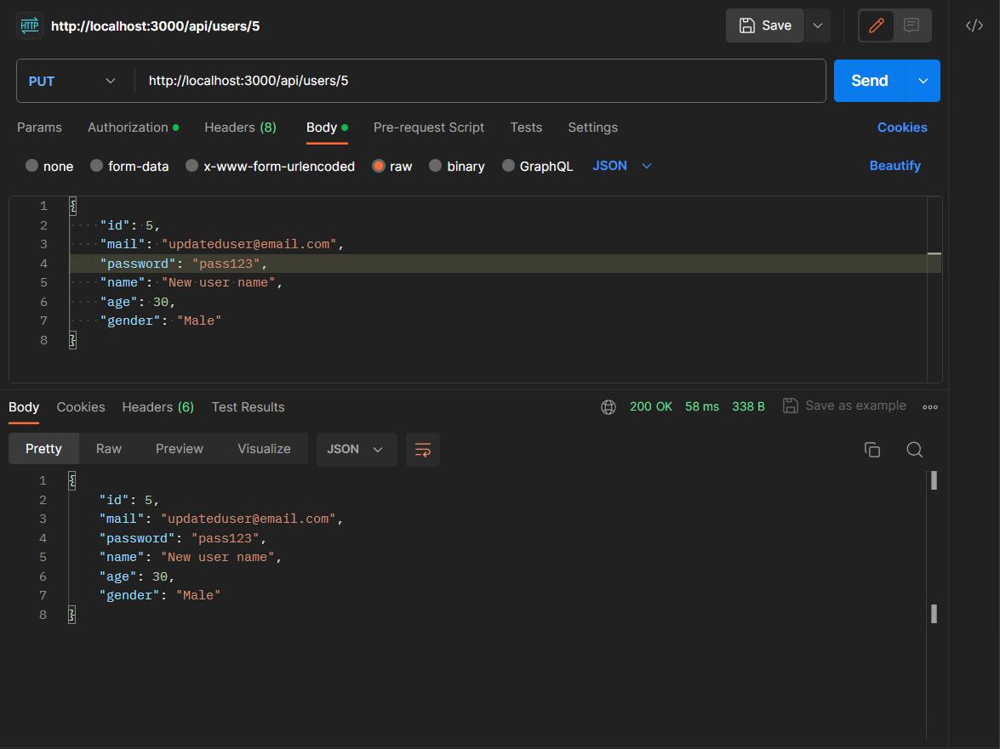
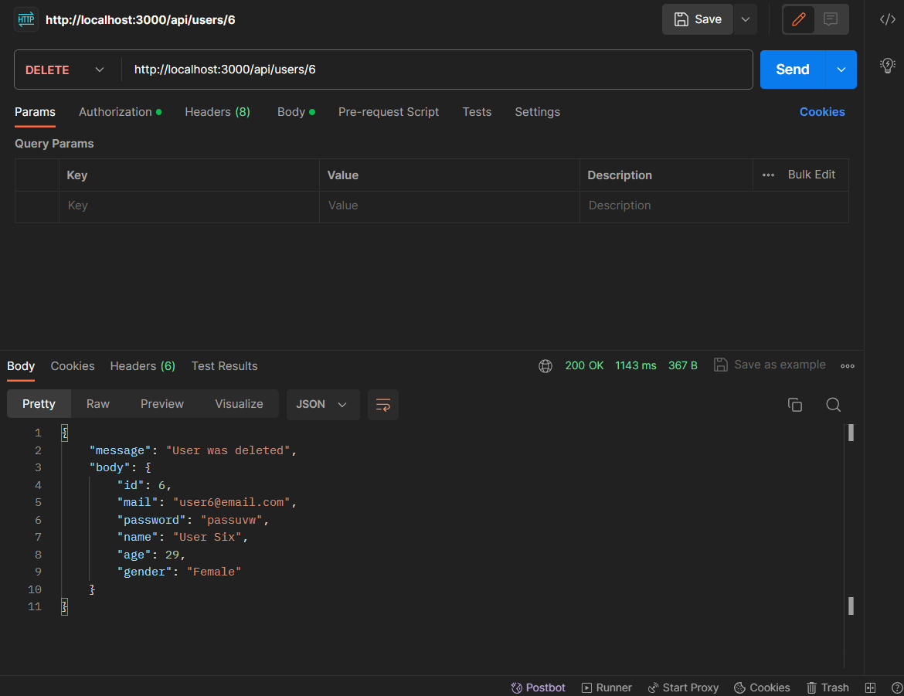
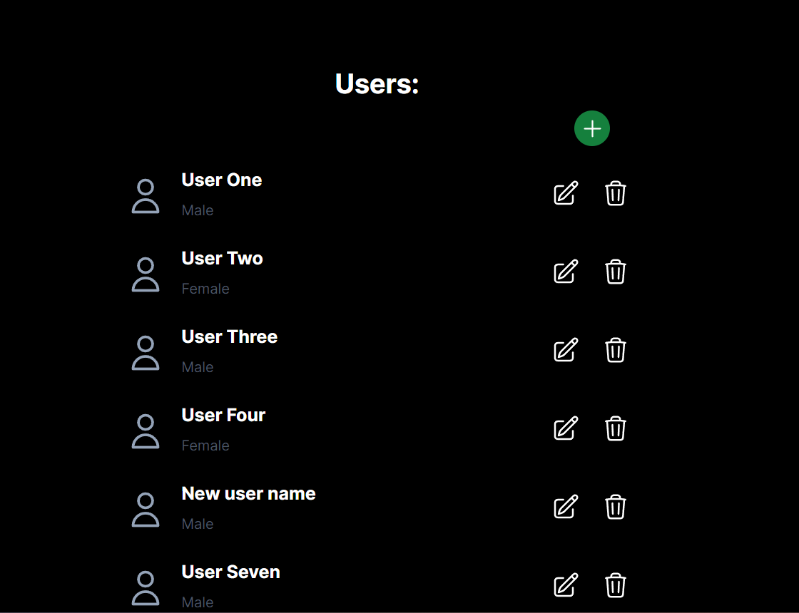
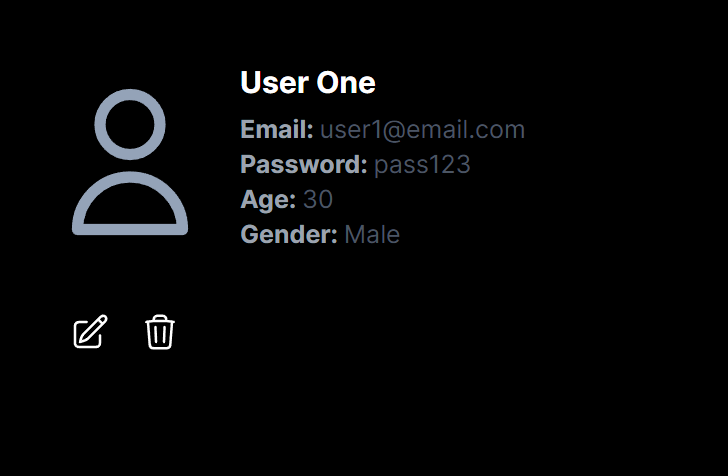
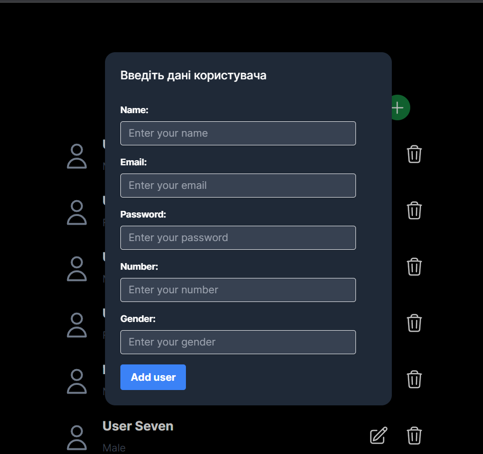
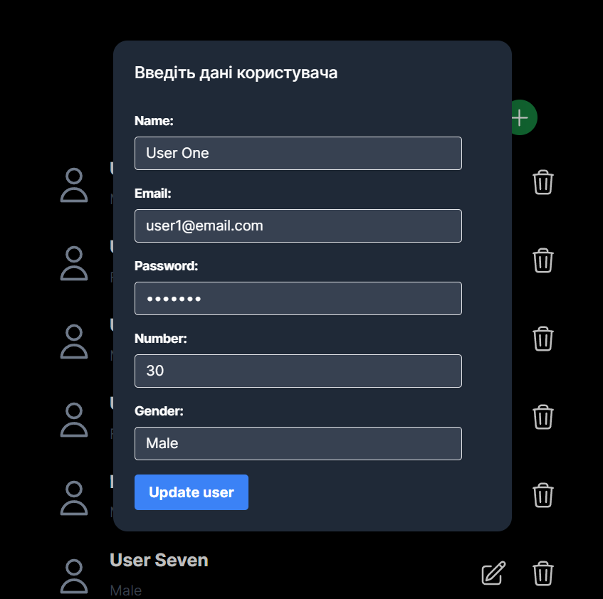
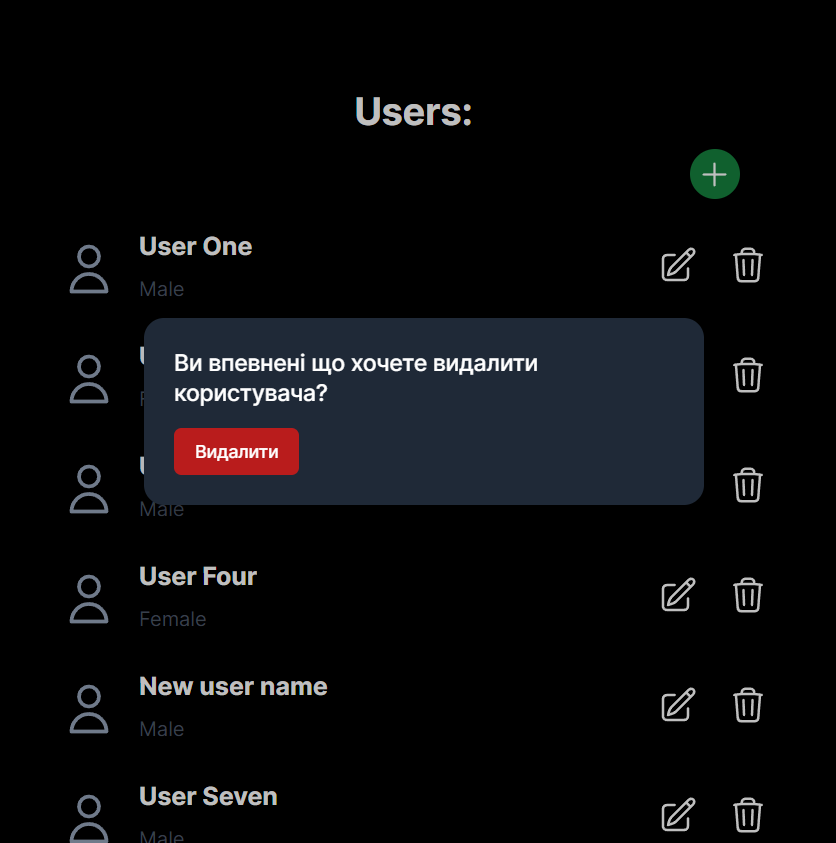

# Тестування працездатності системи


## Передумови

### 1. Встановити залежнсті проекту
```bash
$ npm install
```

### 2. Запустити сервер
```bash
$ npm run dev
```
## Перевірити працездатність сервісів

### GET запит на отримання всіх користувачів



### GET запит на отримання користувача за id



### POST запит на створення користувача (повертається створений користувач)



### PUT запит на оновлення користувача за id (повертається оновлений користувач)



### DELETE запит на видалення користувача за id (повертається повідомлення та видалений користувач)



## Клієнтська частина, яка теж взаємодіє з базою даних

### GET запит на отримання всіх користувачів (сторінка з усіма користувачами)



### GET запит на отримання користувача за id (сторінка з користувачем)



### POST запит на створення користувача (форма для додавання користувача)



### PUT запит на оновлення користувача за id (форма для оновлення користувача)



### DELETE запит на видалення користувача за id (вікно з підтвердженням видалення користувача)


